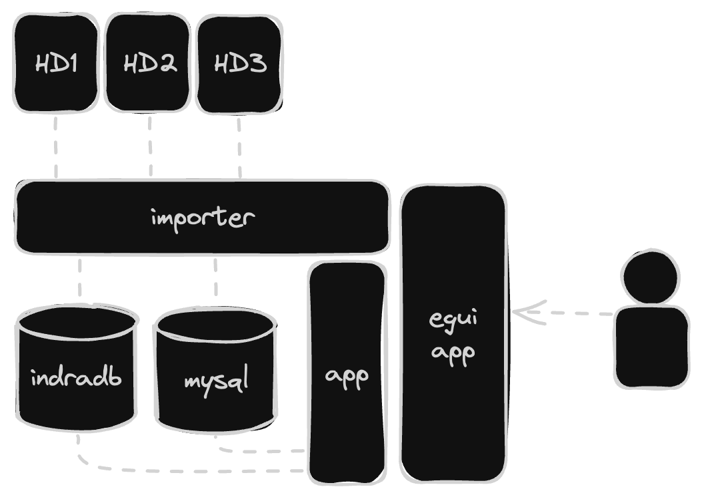

> # WIP!!!
> This project is still very much work in progress, and that aside, I'm in no way
a professional at any of this so dont judge me decisions that hard but also
consider that I made a lot of choices for the sake of learning something new and
not because they were the easiest option.

# Imaginator
A project to organize your thousends of images and ideally also find the most 
interesting ones.

There are a few different aspects to this project, but before going into these
I should explain my situation and why I though I needed to build something like
this myself. 

## Use Case
Since I have done quite a bit of Photography and Videography work I have a lot of
images, with a lot I mean more then 6TB of data. This amount of data is not easy
to use it leads to a lot of complications and is just all in all a headache.

Some of the things that make it especially difficult to deal with are the following:
- Wanting to share images and videos with friends.
- Creating backups of media and still keeping track of what has been backed up
and what not.
- Having mulitple versions of the same image due to editing, compression or whatever
- Browsing the media in ways that is not nessesarly linear or based on a more complex
system then tags provide.

> All of the above mentioned things then bring me to the following conclusions:

## Considerations

- There is a lot of data, which means a fully hosted solution is not possible
(or at least not with my current salary)
- I want to be able to unplug harddrives and plug them back in.
- There has to be some way of sharing images with friends

## Current System

Before we dive into the current design of the system take into account that I'm
trying to keep it simple but at the same time plan for the things that I definetly
want to have in the future.

For this exact reason I have split up the importer and the app into their own
libraries instead of being a single library. The importer contains code that in
every situation I can imagine will have to run locally on some machine since it
needs access to the harddrives. The application on the other hand has applications
as a web app which is impossible for the importer code.

Finally since I just want to have something that works for now, the egui app is
what is acting as my current frontend and just combines the two libraries and 
makes them usable.

#### Glossary
- `HD-` - Some harddrive that contains images videos and any other data.
- [`importer`](https://github.com/tomellm/image-organizer/tree/master/imaginator/imaginator_importer) -
currently just a library that contains the code for loading the data from the
drives.
- [`app`](https://github.com/tomellm/image-organizer/tree/master/imaginator/imaginator_app) - 
a library that contains all the application code to work with the images that are
present in the datastores.
- `mysql` - simple mysql database that contains all the registered medias metadata
like name, filesize, xmp-data and actual meta-data as well as any kind of relational
data created by the user
- [`indradb`](https://github.com/indradb/indradb) - a graph database that stores
any additional graph based infromation created by the user
- [`egui-app`](https://github.com/tomellm/image-organizer/tree/master/imaginator/imaginator_egui) - 
a [egui](https://github.com/emilk/egui) application that uses both the app and importer
libraries.

